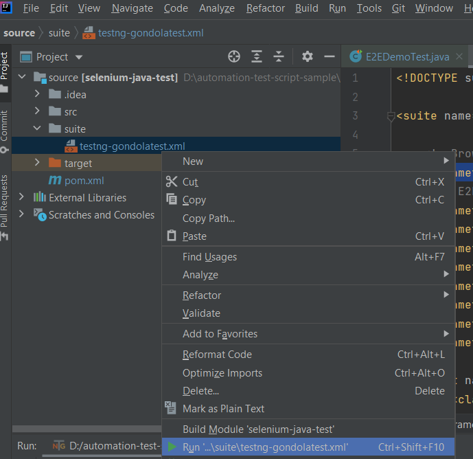

## Description
A simple Selenium test scripts to test an ecommerce website at https://demo.gondolatest.com/

## Automated Tests
[E2E_Workflow](./E2E_Workflow.md)

## Prerequisites
1.  Java Development Kit 8 (or above)
2.  Maven [ http://maven.apache.org/install.html ]
3.  Git (optional) [ http://git-scm.com/downloads ]
4.  IDE (optional) [[eclipse](https://www.eclipse.org/downloads/), [vscode](https://code.visualstudio.com/download) or [IntelliJ](https://www.jetbrains.com/idea/)]
## Getting Started
### 1. Checkout source 
   - Download the zip source at https://github.com/logigear-japan/automation-test-script-sample and extract it
   - Or use git command: 
   ```console
   $ git clone https://github.com/logigear-japan/automation-test-script-sample.git
   ```
### 2. Set browser 
Edit value **\<parameter name="browser" value="firefox"/>** in selenium-web-automation\source\suite\testng-gondolatest.xml
### 3. Run test script
### 3.1 Command line
   Go to the maven directory
   ```console
   $ cd ./selenium-web-automation/source
   ```
   Build and run test
   ```console
   $ mvn clean test
   ```
### 3.2 IntelliJ
   

All steps are recorded in this video