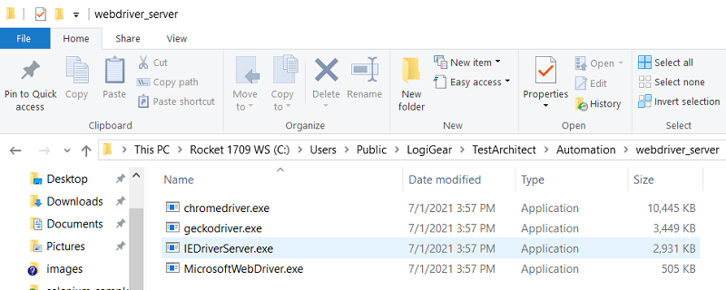
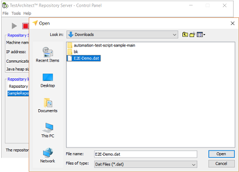
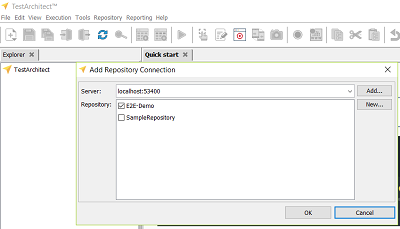
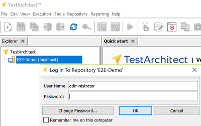
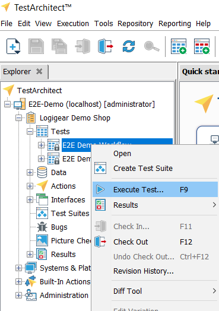
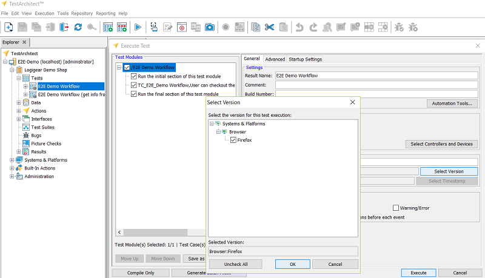
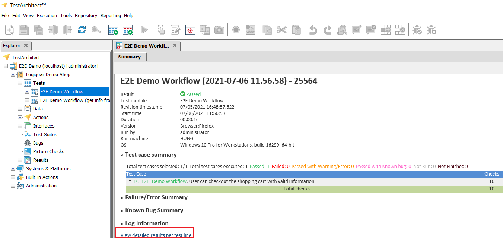

## Description
A simple TestArchitect test scripts to test an ecommerce website at https://demo.gondolatest.com/

## Automated Tests
[E2E_Workflow](./E2E_Workflow.md)

## Prerequisites
1.  TestArchitect [ https://docs.testarchitect.com/user-guide/getting-started/testarchitect-installation-guide/ ]
2.  Git (optional) [ http://git-scm.com/downloads ]

## Getting Started

### 1. Checkout source 
   - Download the zip source at https://github.com/logigear-japan/automation-test-script-sample and extract it
   - Or use git command: 
   ```console
   $ git clone https://github.com/logigear-japan/automation-test-script-sample.git
   ```

### 2. Download webdriver for chrome and firefox
- Download corresponding chromedriver (operating system and chrome version) for chrome here: https://chromedriver.chromium.org/downloads
- Download corresponding geckodriver (operating system and chrome version)for firefox here: https://github.com/mozilla/geckodriver/releases
- Extract downloaded webdrivers and copy to installed TestArchitect directory C:\Users\Public\LogiGear\TestArchitect\Automation\webdriver_server (for windows)
  
  

### 3. Import repository 
- Open TestArchitect-Repository Server application
- Import sample repository /automation-test-script-sample/testarchitect-web-automation/repository/E2E-Demo.dat: **Tools->Import repositoty...**
  
    

### 4. Open TestArchitect and connect to imported repository in step 3
- Open TestArchitect and connect to repositoy Server application: **Repository -> New Repository Connection...**
- Choose  Server: localhost:53400 and check E2E-Demo
  
  
- Double click E2E-Demo (localhost) repository to open it (empty passord)
  
    

### 5. Run test script
- Right click **E2E Demo Workflow** then **Execute Test...**
  
  
- Click **Execute** button to execute test (chrome is default browser)
- If you want to run with Firefox, click **Select version** button then check Firefox and click **Execute** button
  
  

### 6. View test results
- Click on View detailed results per test line to view test results
  
  

All steps are recorded in this video